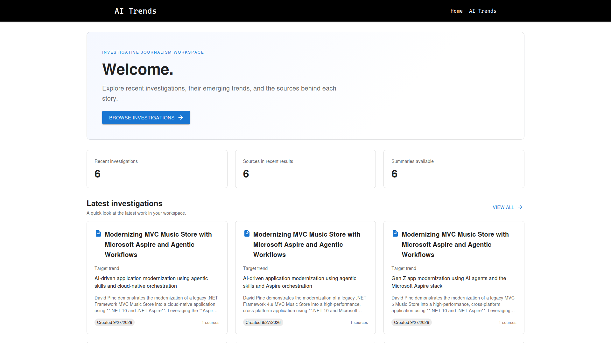
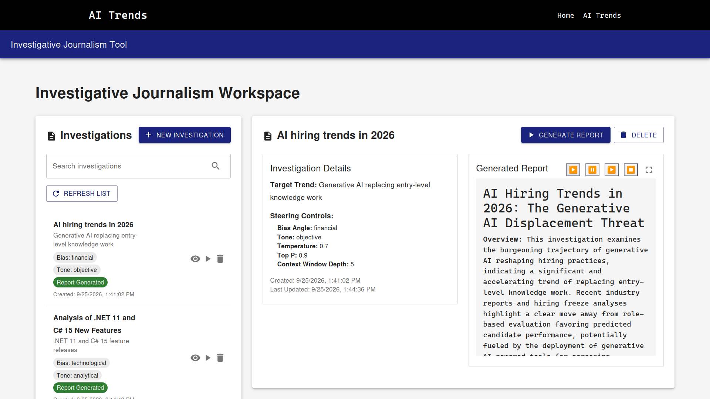
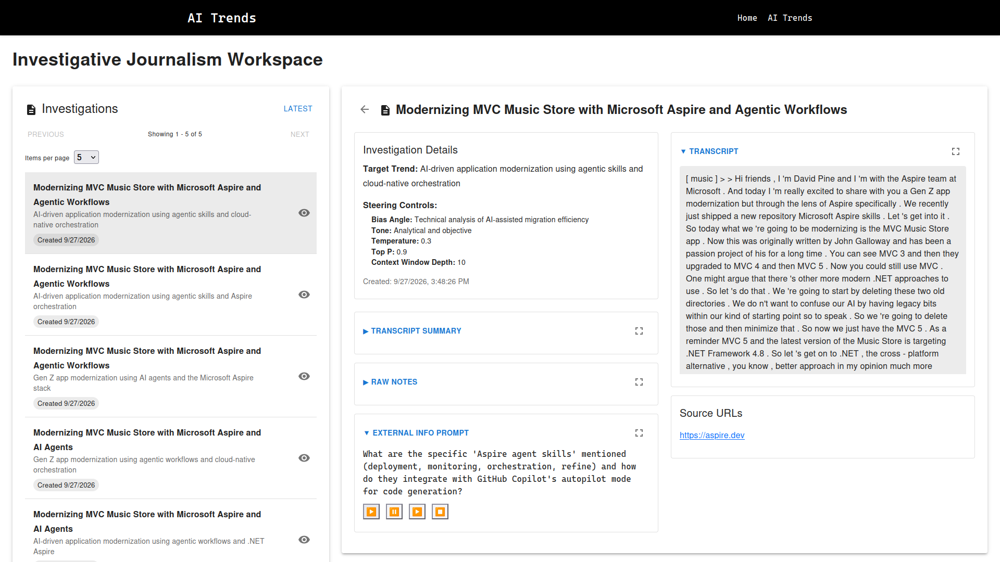
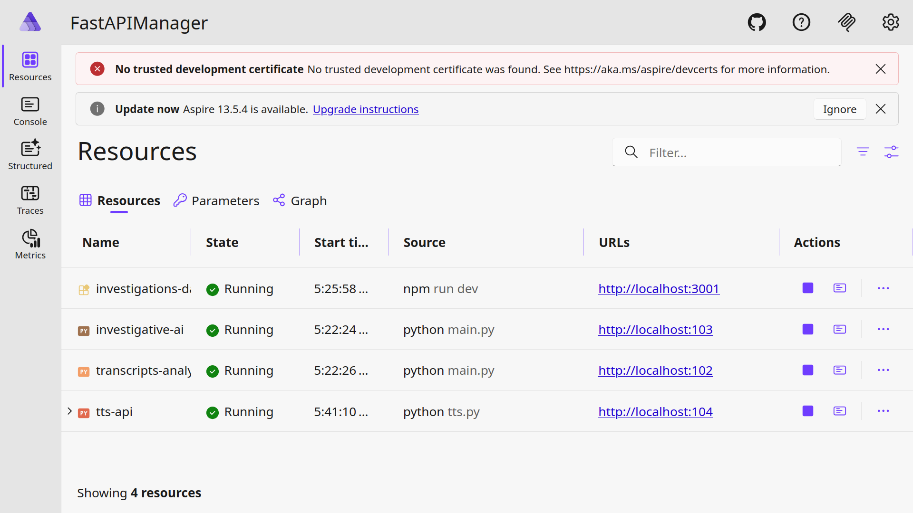
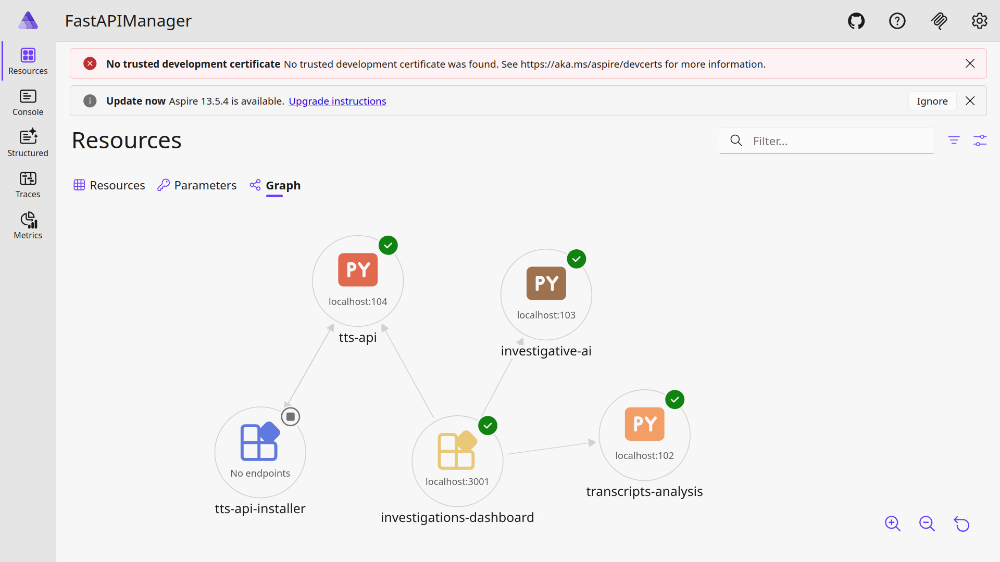

# Investigative Journalism Workspace

An AI-assisted research workspace for collecting investigation leads, reviewing
transcripts and sources, and generating reports about emerging trends. The
project combines a React dashboard with Python APIs for transcript analysis,
investigation management, and text-to-speech. A .NET Aspire AppHost is included
for running the services together during local development.

## Screenshots

### Workspace

The home page highlights recent investigations and links into the investigation
workspace. The detail view brings together investigation controls, transcripts,
summaries, notes, prompts, and source URLs.

| Home | Investigation workspace |
| --- | --- |
|  |  |

The AI Trends page supports creating and reviewing investigations, with
generated reports and a history of saved work.

| AI Trends report and saved investigations | Investigation detail view |
| --- | --- |
|  |  |

### Local service orchestration

The Aspire dashboard shows the services and their dependencies while running.

| Service resources | Service dependency graph |
| --- | --- |
|  |  |

## Components

| Component | Purpose | Documentation |
| --- | --- | --- |
| `investigations-dashboard/` | React and TypeScript frontend for the home page, investigation list/details, and AI Trends workspace. | [Dashboard README](investigations-dashboard/README.md) |
| `transcripts_analysis/` | FastAPI service that retrieves YouTube transcripts, extracts investigation fields, and stores results. | [Transcript API README](transcripts_analysis/README.md) |
| `investigative_ai/` | FastAPI service for creating and managing investigations and streaming generated reports. | [Investigative AI README](investigative_ai/README.md) |
| `tts_api/` | FastAPI text-to-speech service used by the dashboard's playback controls. | — |
| `aspireDevs/FastAPIManager/` | .NET Aspire AppHost for starting the dashboard and Python services together. | — |

## Requirements

- Node.js and npm
- Python 3 and pip
- MongoDB
- An Ollama-compatible server and the model configured for each API
- .NET 10 SDK and Aspire workload to use the AppHost

The Python APIs use Hugging Face models that may download on first startup.
Transcript generation also requires access to the video's YouTube captions.
Text-to-speech uses gTTS and requires network access.

## Run locally

Start MongoDB and Ollama first. Configure each API using the environment
variables described in its README; do not commit credentials or local `.env`
files. Then start each service in its own terminal from the project root:

```bash
# Terminal 1: transcript analysis API (http://localhost:8100)
cd transcripts_analysis
python3 -m venv .venv
source .venv/bin/activate
pip install -r requirements.txt
python3 app/main.py
```

```bash
# Terminal 2: investigations and report-generation API (http://localhost:8000)
cd investigative_ai
python3 -m venv .venv
source .venv/bin/activate
pip install -r requirements.txt
python3 -m app.main
```

```bash
# Terminal 3: text-to-speech API (http://localhost:5000)
cd tts_api
python3 -m venv .venv
source .venv/bin/activate
pip install -r requirements.txt
python3 tts.py
```

```bash
# Terminal 4: dashboard (http://localhost:3000)
cd investigations-dashboard
npm ci
npm run dev
```

The backend APIs expose interactive documentation at
[`http://localhost:8100/docs`](http://localhost:8100/docs) and
[`http://localhost:8000/docs`](http://localhost:8000/docs).

## Aspire

The AppHost is at
[`aspireDevs/FastAPIManager/FastAPIManager.AppHost`](aspireDevs/FastAPIManager/FastAPIManager.AppHost).
Its current local endpoint mappings are dashboard `3001`, transcript analysis
`102`, investigative AI `103`, and TTS `104`. Run it with the .NET 10 SDK and
Aspire workload:

```bash
cd aspireDevs/FastAPIManager/FastAPIManager.AppHost
dotnet watch
```

Before running the AppHost from another checkout or machine, update the absolute
project and virtual-environment paths in `AppHost.cs`. Also note that the
dashboard currently contains hard-coded API URLs for direct local service
ports (`8100`, `8000`) and a TTS URL (`10.42.0.243:5000`); it does not yet use
the Aspire endpoint references. Update those frontend URLs to match the services
you run. The backend CORS allowlists may also need to include the dashboard's
origin (`http://localhost:3000` for direct Vite development, or
`http://localhost:3001` through the current AppHost mapping).

## API entry points

- Transcript analysis: `POST /api/v1/investigations/?video_id=<youtube-video-id>`
  creates an investigation from an 11-character YouTube video ID.
- Investigative AI: endpoints under `/api/v1/investigations/` create, search,
  retrieve, and delete investigations, and stream generated reports.
- Text-to-speech: `POST /tts` accepts text and speech settings and returns MP3
  audio.

See each component README and the API docs for configuration, request schemas,
and additional endpoints.